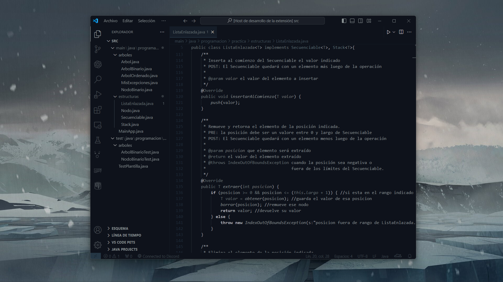

# Mizu Dark Blue

The theme captures the essence of a rugged, wintry landscape where snow-capped peaks reflect the azure sky above. Crisp, icy blues dominate the color palette, mirroring the serene expanses of frozen lakes and rushing rivers that cut through the pristine wilderness. Soft whites and grays evoke the quiet stillness of snow-covered forests and misty mountain trails. This theme encapsulates the allure of exploration in a majestic yet challenging environment, where every vista promises both beauty and the thrill of the unknown.

## Installation

1. Open Visual Studio.
2. Go to `Extensions > Manage Extensions`.
3. Search for "mizu-dark-blue".
4. Click on "Install".

## Contact

- Email: lolafioramantiuni@gmail.com
# Mizu-Dark-Theme-VScode
